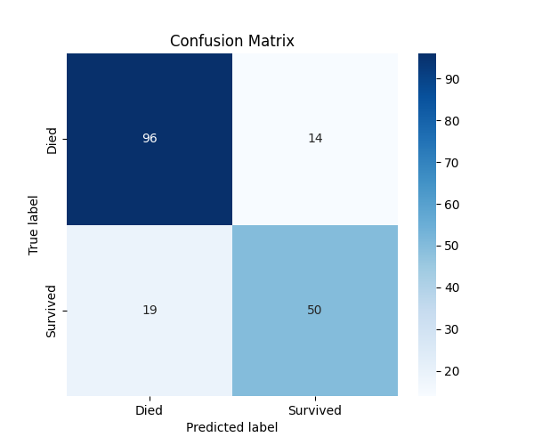
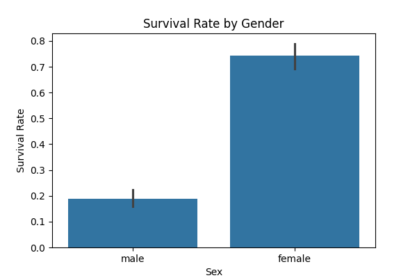
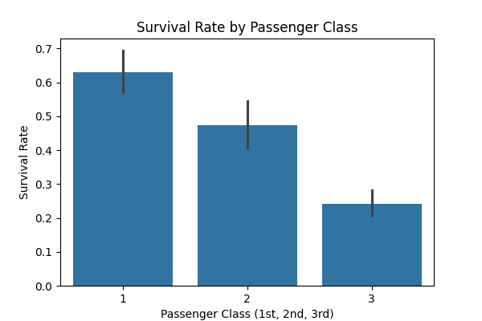

# 🚢 Machine Learning Internship - Foundational Task 3: Titanic Survival Prediction

**Project Name:** `Cognetix_TitanicSurvival`
**Internship Domain:** Machine Learning
**Organization:** Cognetix Technology

---

## 🎯 Objective

The primary objective of this project was to develop a classification model to **predict passenger survival** on the Titanic. The model uses demographic and travel-related features to determine the likelihood of survival, providing insights into which factors contributed most significantly to the outcome.

## ⚙️ Functional Requirements & Key Steps

This project successfully addressed all functional requirements for Task 3:

1.  **Data Acquisition:** Loaded the Titanic dataset (`train.csv`) using Pandas.
2.  **Data Preprocessing:** Handled missing values (imputing Age, Fare, and Embarked) and encoded categorical features (`Sex`, `Embarked`) using one-hot encoding.
3.  **Feature Selection:** Key features (`Age`, `Fare`, `Pclass`, `Sex`, etc.) were selected for modeling.
4.  **Model Training:** Trained and tested a **Random Forest Classifier**.
5.  **Model Evaluation:** Evaluated the model using the four required classification metrics.
6.  **Visualization (EDA):** Visualized survival rates across key groups (Gender, Class, Age Group).

---

## 📊 Results and Performance (Random Forest Classifier)

### Evaluation Metrics

The Random Forest model was evaluated on the test set, achieving strong performance across all required metrics:

| Metric | Value | Interpretation |
| :--- | :--- | :--- |
| **Accuracy Score** | **0.8156** | The model correctly predicted the outcome (Survived/Died) 81.56% of the time. |
| **Precision Score** | **0.7812** | Of all passengers predicted to survive, 78.12% actually survived. |
| **Recall Score** | **0.7246** | The model correctly identified 72.46% of all passengers who actually survived. |
| **F1-Score** | **0.7519** | The harmonic mean of Precision and Recall, providing a balanced measure. |

### Visualizations

#### Confusion Matrix

The confusion matrix shows the true positives and true negatives, confirming the model's predictive ability.

#### Survival Rate by Gender

This chart illustrates the significant difference in survival rates based on gender, highlighting the "women and children first" factor.

#### Survival Rate by Passenger Class

This bar chart visualizes the strong correlation between Pclass and survival, showing that 1st class passengers had the highest survival probability.

#### Survival Rate by Age Group

This chart displays survival across different age cohorts, confirming that children had a higher chance of survival.

---

## 🛠️ Technology Stack

* **Language:** Python
* **Data Manipulation:** Pandas, NumPy
* **Machine Learning:** Scikit-learn (`RandomForestClassifier`)
* **Visualization:** Matplotlib, Seaborn
* **Dataset Source:** Kaggle Titanic Dataset (`train.csv`)

---

## 🚀 How to Run the Project

1.  **Clone the Repository:**
    ```bash
    git clone [https://github.com/Hemavarni1501/Cognetix_TitanicSurvival](https://github.com/Hemavarni1501/Cognetix_TitanicSurvival)
    cd Cognetix_TitanicSurvival
    ```
2.  **Ensure Data is Present:** Verify that the **`train.csv`** file is in the root directory.
3.  **Install Dependencies:**
    ```bash
    pip install pandas numpy scikit-learn matplotlib seaborn
    ```
4.  **Execute the Script:**
    ```bash
    python main.py
    ```
    *The script (`main.py`) will perform preprocessing, train the model, print the evaluation metrics, and save all required visualizations.*

---

# Project Done By

Hemavarni S